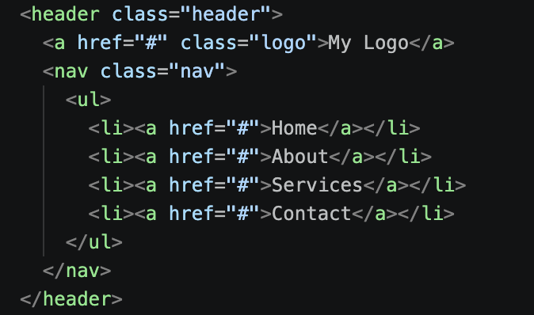
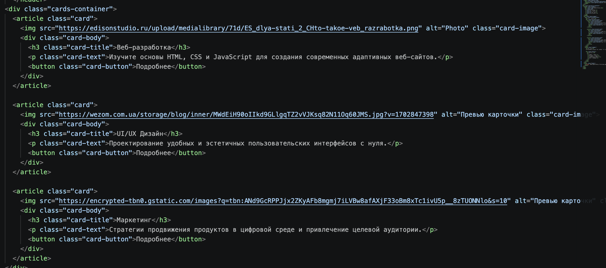
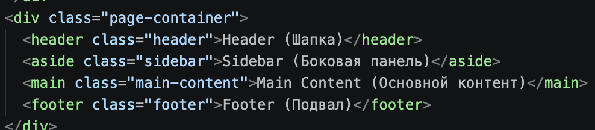
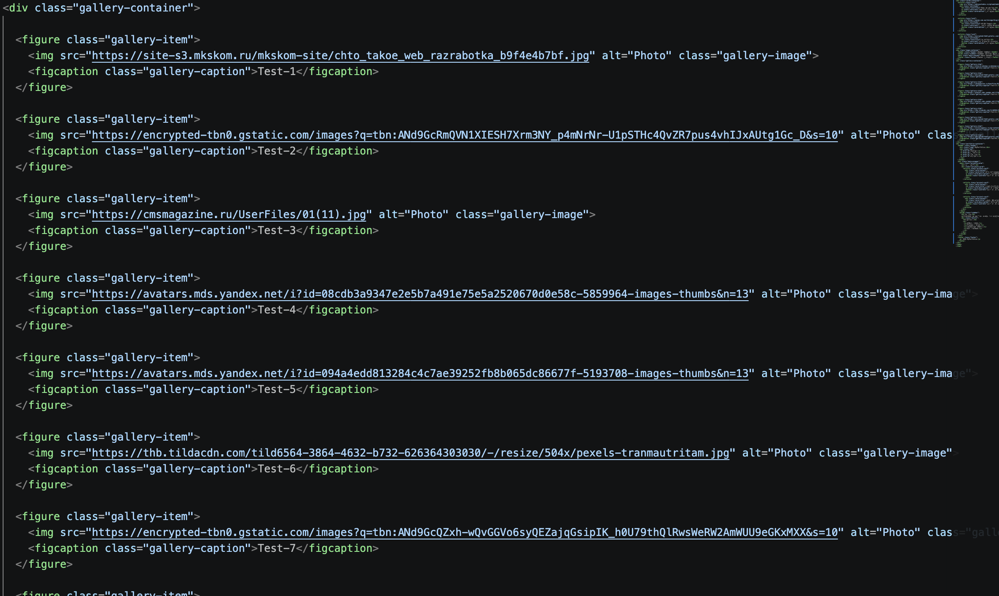
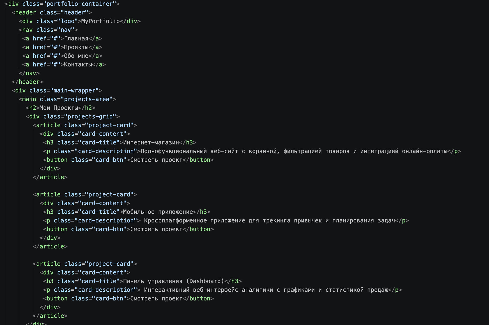

# Assignment #2: Advanced CSS (Flexbox & Grid)

**Course:** Web Technologies(Front-End) 
**Student Name:** Seitkapar Magzhan
**Group:** IT-2501  

---
## Description
In this assignment I built several tasks using CSS Flexbox and CSS Grid layouts

## Tasks Overview

### Part 1. Flexbox
- Task 0. Navigation Bar: Created a header with logo on the left and links on the right using flexbox
- Task 1. Card Row: Made 3 cards with images, titles, text and buttons aligned in a row using flexbox and added hover effects

### Part 2. Grid System
- Task 2. Page Layout with Grid Areas: Built a page template with header, sidebar, main content and footer using grid-template-areas
- Task 3. Image Gallery: Created a 3x3 photo gallery with 9 images and caption hover effect using CSS Grid

### Part 3. Combining Flexbox & Grid
- Task 4. Portfolio Page: Combined Flexbox for navigation and cards with CSS Grid for main section layout

## Screenshots

### Task 0

### Task 1

### Task 2

### Task 3

### Task 4

## Summary
During this work I learned how to use Flexbox for 1D alignments and CSS Grid for overall page layouts. I combined both techniques in Task 4 to build a complete web page.
